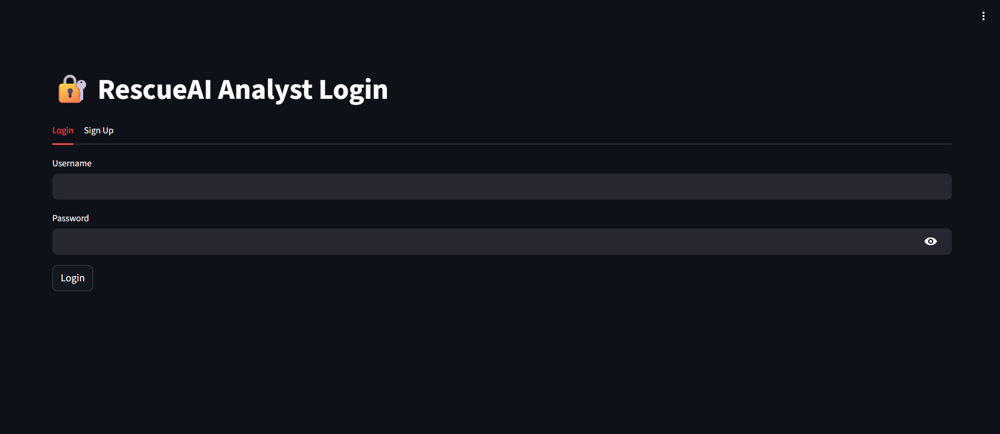
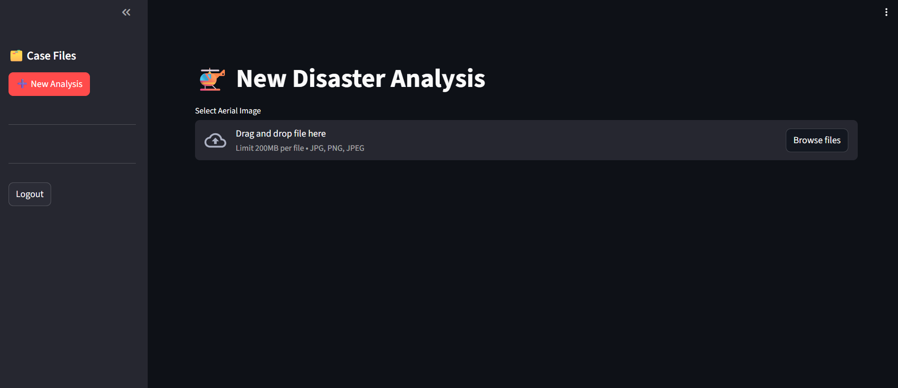
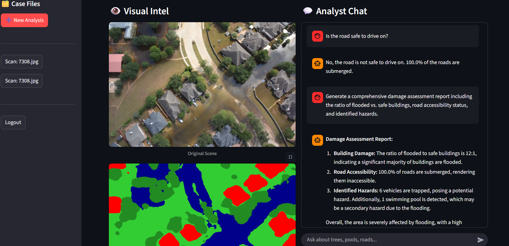
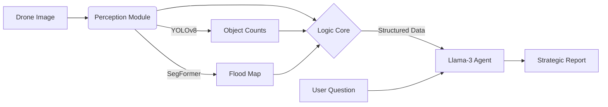

# 🚁 ResQ-Agent: Neuro-Symbolic Disaster Response AI

[](https://huggingface.co/spaces/Tirush12/ResQ-Agent)
[](https://www.python.org/)
[](https://streamlit.io/)
[](https://github.com/ultralytics/ultralytics)
[](https://groq.com/)
[](https://opensource.org/licenses/Apache-2.0)

> **A Neuro-Symbolic AI Agent for autonomous post-disaster structural assessment.**
> ResQ-Agent combines fine-tuned Computer Vision models with Large Language Model reasoning to detect flood damage, map terrain, and answer strategic rescue questions in real-time.

---

## 🎮 Try It Live

You don't need to install anything to see ResQ-Agent in action. We have deployed a live version on Hugging Face Spaces.

👉 **[Click Here to Launch ResQ-Agent](https://huggingface.co/spaces/Tirush12/ResQ_Agent)**

---

## 📖 Project Overview

In critical disaster scenarios, manual analysis of drone footage is too slow, and generic AI models often hallucinate details. **ResQ-Agent** solves this by using a **Deterministic Neuro-Symbolic Pipeline**:

1.  **See (Perception):** It extracts ground-truth data using fine-tuned vision models.
    * **YOLOv8** (SAHI-assisted) detects small objects like trapped vehicles and flooded houses.
    * **SegFormer** performs pixel-wise segmentation to map flood water and road accessibility.
2.  **Reason (Logic):** Instead of guessing, the agent calculates precise damage metrics (e.g., *"22% of buildings are flooded"*) using symbolic logic (Python).
3.  **Report (Language):** It uses **Llama-3-70B** (via Groq LPUs) to synthesize professional situation reports and answer user questions based *only* on the verified data.

---

## ✨ Key Features

* **🚁 Autonomous Detection:** Fine-tuned YOLOv8m detects flooded/non-flooded buildings, vehicles, and pools with **76.7% mAP**.
* **🌍 Terrain Segmentation:** Fine-tuned SegFormer (MiT-b0) maps flood extent, road accessibility, and vegetation coverage.
* **🧠 Neuro-Symbolic Reasoning:** Eliminates hallucination by separating *perception* (Vision Models) from *reasoning* (LLM).
* **⚡ Enterprise Speed:** Uses **Groq LPUs** for sub-second text generation and **SAHI (Slicing Aided Hyper Inference)** for high-res image processing.
* **💬 Interactive Analyst:** A Streamlit-based Chat UI with session memory, allowing users to ask strategic questions like *"Is the road passable?"* or *"Are there survivors trapped?"*.

---

## 🚀 How to Use ResQ-Agent

### 1. Authentication
The system uses secure, local session management via SQLite.
* **Sign Up:** Create a new account with a unique username and password.
* **Login:** Access your secure dashboard to start a mission.



### 2. Start a New Mission
* Navigate to **"New Analysis"** in the sidebar.
* **Upload:** Drag and drop a high-resolution drone image (JPG/PNG).
* **Process:** Click **"Process Image"**. The AI pipeline will run object detection and segmentation in the background.



### 3. Review Intelligence
Once processing is complete, the dashboard splits into two views:
* **Left Panel (Visual Intel):** Displays the original scene, the AI-generated Flood Mask, and a color-coded legend explaining the terrain (Red=Flooded, Blue=Water, etc.).
* **Right Panel (Command Center):** The chat interface is ready for your commands.

### 4. Interactive Command Chat
Ask the AI strategic questions. It will answer using the extracted data.
* *Example:* "Summarize the structural damage."
* *Example:* "Is the main road accessible for a truck?"
* *Example:* "Are there any swimming pools I should be aware of?"



---

## 🏗️ System Architecture

The system follows a "Perception-Logic-Language" workflow designed for high reliability:



## 📊 Performance Metrics

The system's components were rigorously evaluated on the FloodNet test set.

| Model | Task | Dataset | Metric | Score |
| :--- | :--- | :--- | :--- | :--- |
| **YOLOv8m** | Object Detection | FloodNet (Track 2) | mAP50 | **76.7%** |
| **SegFormer-b0** | Semantic Segmentation | FloodNet (Track 1) | mIoU | **~82%** |
| **Llama-3-70B** | Strategic Reasoning | Synthetic QA Pairs | Human Eval | **Pass** |

*Note: Object detection performance is boosted by SAHI (Slicing Aided Hyper Inference), which improves small object detection (e.g., vehicles) by ~15% compared to standard inference.*

## 🛠️ Local Installation

To run ResQ-Agent on your own machine (GPU recommended for optimal vision performance):

### 1. Clone the Repository
```bash
git clone [https://github.com/Tirush-Leo/ResQ-Agent.git](https://github.com/Tirush-Leo/ResQ-Agent.git)
cd ResQ-Agent
```
### 2. Install Dependencies
It is recommended to use a virtual environment.
```bash
# Create and activate virtual environment
python -m venv venv
source venv/bin/activate  # On Windows use: venv\Scripts\activate

# Install libraries
pip install -r requirements.txt
```
### 3. Setup Models (Git LFS)
Due to their large file size, the fine-tuned models are stored using Git Large File Storage (LFS).
```bash
git lfs install
git lfs pull
```
Verification: Ensure models/yolov8_floodnet.pt and the models/segformer_custom/ folder are present and not just 1KB pointer files.
### 4. Setup API Keys
Create a .env file in the root directory to store your Groq API key securely.
```bash
git lfs install
git lfs pull
```
### 5. Run the App
Launch the Streamlit interface.
```bash
git lfs install
git lfs pull
```

---

### **3. Project Structure Section**


## 📂 Project Structure

```text
ResQ-Agent/
├── models/               # Fine-tuned AI Models (LFS tracked)
│   ├── yolov8_floodnet.pt       # YOLOv8m for Object Detection
│   └── segformer_custom/        # SegFormer-b0 for Semantic Segmentation
├── app.py                # Streamlit Frontend (UI & Session Management)
├── backend.py            # Core Logic (Neuro-Symbolic Pipeline & Groq)
├── tools.py              # Vision Inference Wrappers (SAHI + Transformers)
├── database.py           # SQLite Database for Chat History & Auth
├── requirements.txt      # Python Dependencies
├── packages.txt          # System Dependencies (for Hugging Face Spaces)
├── .env                  # API Keys (Excluded from Git)
└── assets/               # Screenshots and Demo Images for README
```
---

### **4. Acknowledgements Section**

## 🤝 Acknowledgements

* **[FloodNet Dataset](https://github.com/BinaLab/FloodNet-Supervised_v1.0):** Rahnemoonfar et al. for the high-resolution post-hurricane imagery used for training.
* **[Groq](https://groq.com/):** For providing ultra-low latency inference for the Llama-3 reasoning engine.
* **[Ultralytics](https://github.com/ultralytics/ultralytics):** For the YOLOv8 architecture.
* **[Hugging Face](https://huggingface.co/):** For the Transformers library and Spaces hosting.

---

**Author:** Tirush Dumil Wickramasingha  


