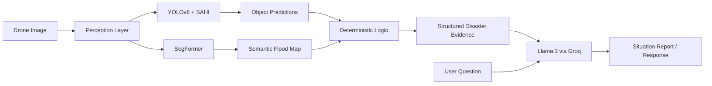
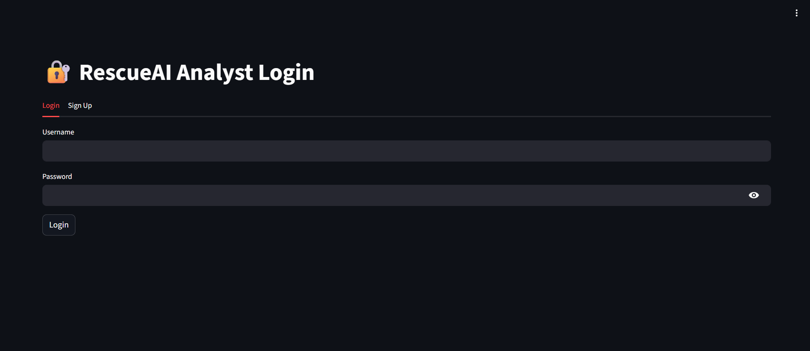
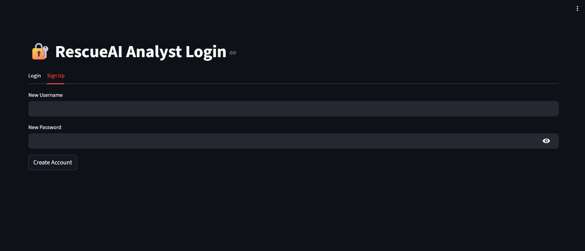
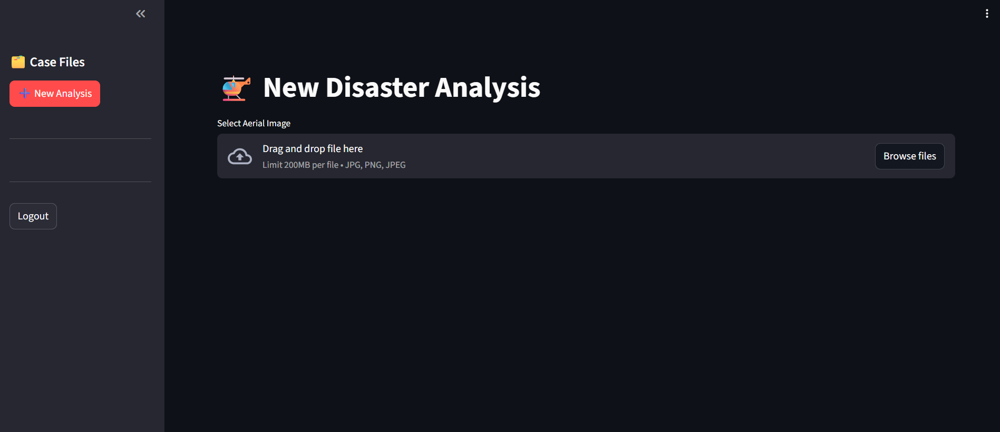
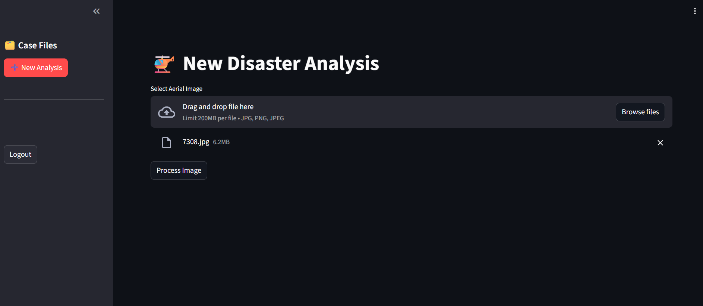
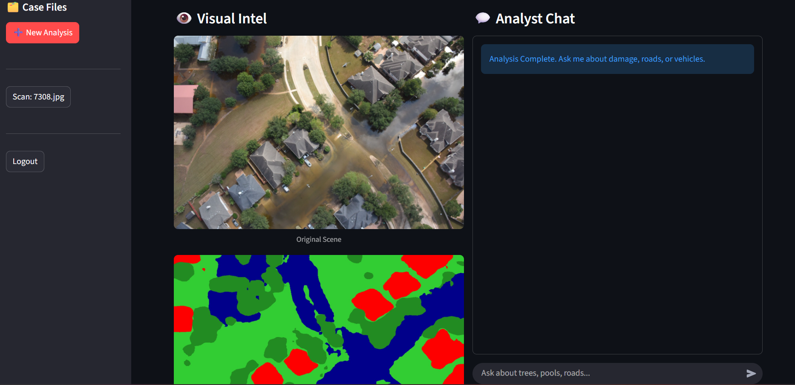
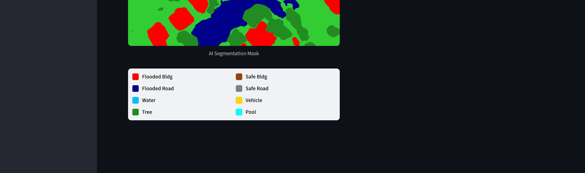
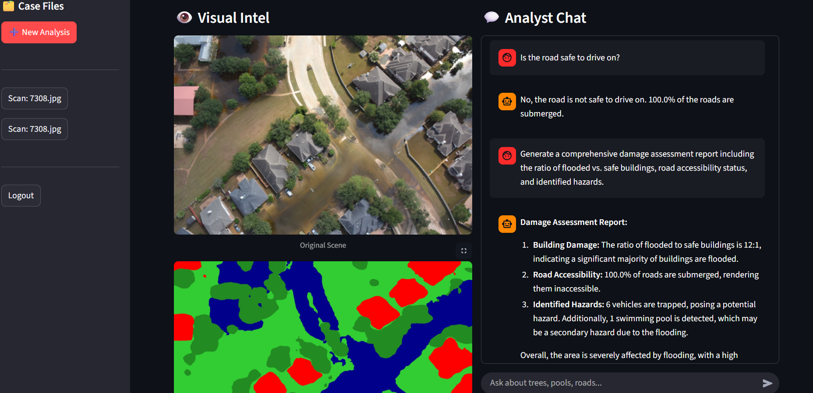

# 🚁 ResQ-Agent: Neuro-Symbolic Disaster Response AI

[](https://huggingface.co/spaces/Tirush12/ResQ_Agent)
[](https://www.python.org/)
[](https://streamlit.io/)
[](https://github.com/ultralytics/ultralytics)
[](https://groq.com/)
[](https://opensource.org/licenses/Apache-2.0)

> **A neuro-symbolic AI system for post-disaster drone-image analysis and decision support.**
>
> ResQ-Agent combines fine-tuned computer vision models, deterministic reasoning, and LLM-based interaction to analyze flood damage, assess terrain conditions, and answer disaster-response queries using structured visual evidence.

---

## 🎮 Live Demo

ResQ-Agent is deployed on Hugging Face Spaces and can be tested without local installation.

👉 **[Launch ResQ-Agent](https://huggingface.co/spaces/Tirush12/ResQ_Agent)**

---

## 📖 Overview

Rapid interpretation of aerial imagery is critical after natural disasters, but manually reviewing large volumes of drone imagery can be slow and difficult.

ResQ-Agent addresses this problem using a **Perception → Logic → Language** architecture.

Instead of sending raw images directly to an LLM, the system first extracts structured information using specialized computer vision models. Deterministic logic then transforms those predictions into interpretable disaster metrics before the resulting evidence is provided to the language model.

This architecture is designed to reduce unsupported responses and make generated reports more closely grounded in the outputs of the perception pipeline.

### Pipeline

1. **Perception**
   - Fine-tuned **YOLOv8m** detects objects such as flooded buildings, non-flooded buildings, vehicles, and swimming pools.
   - **SAHI (Slicing Aided Hyper Inference)** improves small-object detection in high-resolution drone imagery.
   - Fine-tuned **SegFormer MiT-B0** performs semantic segmentation for flood extent, road accessibility, and terrain analysis.

2. **Deterministic Reasoning**
   - Python-based logic converts model predictions into structured statistics and interpretable disaster indicators.
   - Examples include object counts, affected-area estimates, flood coverage, and road-accessibility information.

3. **Language Reasoning**
   - **Llama 3**, served through Groq, receives the structured evidence together with the user's question.
   - The model generates situation summaries and answers disaster-response queries using the extracted information as context.

---

## ✨ Key Features

- **🚁 Multi-Model Visual Perception**  
  Combines object detection and semantic segmentation to analyze high-resolution post-disaster imagery.

- **🔍 Small-Object Detection with SAHI**  
  Uses adaptive image slicing to improve detection of small objects such as vehicles and distant structures.

- **🌍 Terrain Understanding**  
  SegFormer produces pixel-level maps for flood extent, vegetation, roads, buildings, and other terrain classes.

- **🧠 Neuro-Symbolic Reasoning**  
  Separates learned visual perception from deterministic calculations before passing structured evidence to the LLM.

- **🛡️ Grounded LLM Responses**  
  Mitigates hallucinations by grounding language-model responses in structured outputs produced by the vision and reasoning layers.

- **⚡ Optimized Inference**  
  Uses Groq-based LLM inference and adaptive image slicing to reduce end-to-end inference latency.

- **💬 Interactive Analysis**  
  Streamlit-based interface allows users to upload imagery, inspect predictions, and ask scenario-specific questions.

- **🔐 Session Management**  
  SQLite-based authentication and conversation persistence support multiple analysis sessions.

---

## 🏗️ System Architecture

ResQ-Agent follows a three-stage neuro-symbolic workflow:


```mermaid
graph LR
    A[Drone Image] --> B[Perception Layer]

    B --> C[YOLOv8 + SAHI]
    B --> D[SegFormer]

    C --> E[Object Predictions]
    D --> F[Semantic Flood Map]

    E --> G[Deterministic Logic]
    F --> G

    G --> H[Structured Disaster Evidence]

    H --> I[Llama 3 via Groq]
    J[User Question] --> I

    I --> K[Situation Report / Response]
```

### Architecture Layers

| Layer | Component | Responsibility |
|---|---|---|
| **Perception** | YOLOv8m + SAHI | Object detection in high-resolution imagery |
| **Perception** | SegFormer MiT-B0 | Pixel-level terrain and flood segmentation |
| **Reasoning** | Python logic | Deterministic calculation of disaster metrics |
| **Language** | Llama 3 + Groq | Evidence-grounded reporting and question answering |
| **Application** | Streamlit | Interactive user interface |
| **Persistence** | SQLite | Authentication and conversation/session storage |

---

## 📊 Performance

The vision components were evaluated using the **FloodNet** dataset.

| Model | Task | Dataset | Metric | Result |
|---|---|---|---|---:|
| **YOLOv8m** | Object Detection | FloodNet Track 2 | mAP50 | **76.7%** |
| **SegFormer MiT-B0** | Semantic Segmentation | FloodNet Track 1 | mIoU | **~82%** |

### Inference Optimization

- **~15% improvement** in small-object detection using SAHI compared with standard inference.
- **~70% reduction in inference latency** through optimized inference, Groq-based LLM serving, and adaptive image slicing.

> Performance values correspond to the experimental configurations used during development and may vary depending on hardware, image resolution, and inference settings.

### LLM Reasoning

The language layer was evaluated qualitatively using scenario-based disaster-response questions generated from structured model outputs.

Unlike the perception models, this component is therefore **not reported with a formal benchmark score** in this repository.

---

## 🖥️ Using the Application

### 1. Authentication

The application uses local SQLite-based session management.

- **Sign Up:** Create an account with a username and password.
- **Login:** Access the analysis dashboard and previous sessions.

<p align="center">
  
  
</p>

### 2. Start a Mission

From the **New Analysis** page:

1. Upload a high-resolution drone image in JPG or PNG format.
2. Select **Process Image**.
3. The perception pipeline performs object detection and semantic segmentation.
4. Structured disaster information is generated for downstream reasoning.

<p align="center">
  
  
</p>

### 3. Review Visual Intelligence

After inference, the dashboard provides visual and analytical outputs.

**Visual Analysis**
- Original drone image
- Detected objects
- Flood segmentation mask
- Terrain visualization

**Command Interface**
- Structured disaster information
- LLM-assisted analysis
- Interactive disaster-response queries

<p align="center">
  
  
</p>

### 4. Ask Strategic Questions

Example queries include:

- *"Summarize the structural damage."*
- *"Is the main road accessible for emergency vehicles?"*
- *"How many buildings appear to be affected?"*
- *"Which regions should responders inspect first?"*

<p align="center">
  
</p>

---

## 🛠️ Local Installation

### Prerequisites

- Python **3.10+**
- Git
- Git LFS
- Groq API key
- GPU recommended for faster computer-vision inference

### 1. Clone the Repository

```bash
git clone https://github.com/Tirush-Leo/ResQ-Agent.git
cd ResQ-Agent
```

### 2. Create a Virtual Environment

#### Linux / macOS

```bash
python -m venv venv
source venv/bin/activate
```

#### Windows

```bash
python -m venv venv
venv\Scripts\activate
```

### 3. Install Dependencies

```bash
pip install --upgrade pip
pip install -r requirements.txt
```

### 4. Download Model Files

The fine-tuned model weights are stored using **Git Large File Storage (LFS)**.

```bash
git lfs install
git lfs pull
```

Verify that the model files were downloaded correctly:

```text
models/
├── yolov8_floodnet.pt
└── segformer_custom/
```

They should contain the actual model files rather than Git LFS pointer files.

### 5. Configure Environment Variables

Create a `.env` file in the project root:

```env
GROQ_API_KEY=your_groq_api_key
```

Do **not** commit `.env` or API keys to version control.

### 6. Run the Application

```bash
streamlit run app.py
```

Open the local Streamlit URL shown in the terminal, typically:

```text
http://localhost:8501
```

---

## 📂 Project Structure

```text
ResQ-Agent/
│
├── .github/
│   └── workflows/                  # CI/CD workflows
│
├── assets/                         # README screenshots and visual assets
│
├── models/
│   ├── yolov8_floodnet.pt          # Fine-tuned YOLOv8m model
│   └── segformer_custom/           # Fine-tuned SegFormer model
│
├── app.py                          # Streamlit application
├── backend.py                      # Neuro-symbolic reasoning and LLM pipeline
├── tools.py                        # Vision inference utilities
├── database.py                     # SQLite authentication/session storage
│
├── requirements.txt                # Python dependencies
├── packages.txt                    # System-level deployment dependencies
├── Dockerfile                      # Container configuration
└── README.md
```

---

## 🧩 Technology Stack

**Computer Vision**
- PyTorch
- YOLOv8
- SegFormer
- SAHI
- OpenCV

**Generative AI**
- Llama 3
- Groq

**Application & Data**
- Streamlit
- SQLite

**Engineering**
- Docker
- Git
- GitHub Actions / CI/CD
- Git LFS

---

## ⚠️ Limitations

ResQ-Agent is a research and engineering prototype and should not be treated as a replacement for professional disaster-response assessment.

Current limitations include:

- Performance depends on image quality, viewpoint, and similarity to the FloodNet training distribution.
- Object detection and segmentation models can produce false positives or false negatives.
- LLM responses are grounded in structured model outputs but may still contain incorrect interpretations.
- Real-world deployment would require broader geographic validation and operational testing.

---

## 🔮 Future Work

Potential extensions include:

- Multi-image and temporal disaster analysis
- Geospatial/GIS integration
- Improved uncertainty estimation
- Additional disaster classes beyond flooding
- Expanded quantitative evaluation of the reasoning layer
- Real-time processing of drone video streams
- Broader validation across geographically diverse datasets

---

## 🤝 Acknowledgements

- **[FloodNet Dataset](https://github.com/BinaLab/FloodNet-Supervised_v1.0)** — Post-disaster aerial imagery used for training and evaluation.
- **[Ultralytics](https://github.com/ultralytics/ultralytics)** — YOLOv8 object-detection framework.
- **[Hugging Face](https://huggingface.co/)** — Transformers ecosystem and Spaces hosting.
- **[Groq](https://groq.com/)** — Low-latency inference for the language reasoning layer.
- **[SAHI](https://github.com/obss/sahi)** — Slicing Aided Hyper Inference for small-object detection.

---

## 📄 License

This project is licensed under the **Apache License 2.0**.

See the [`LICENSE`](LICENSE) file for details.

---

## 👤 Author

**Tirush Dumil Wickramasingha**

[GitHub](https://github.com/Tirush-Leo) •
[LinkedIn](https://www.linkedin.com/in/tirush-dumil/) •
[Hugging Face](https://huggingface.co/Tirush12)
